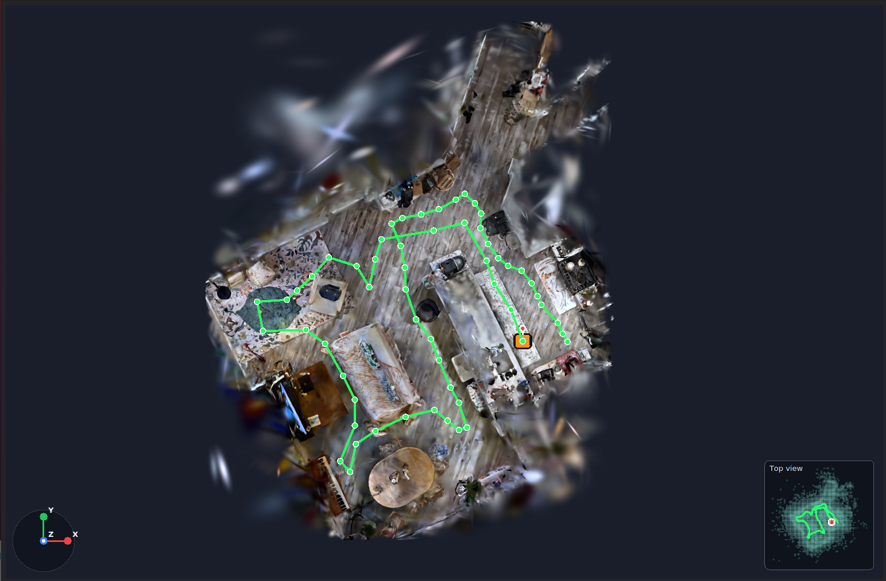
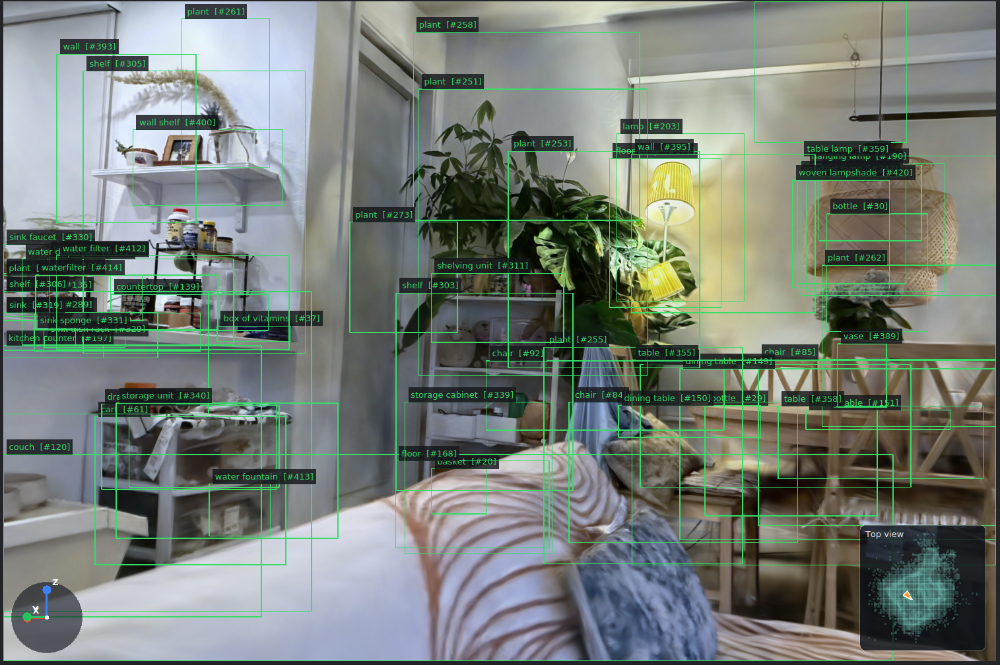
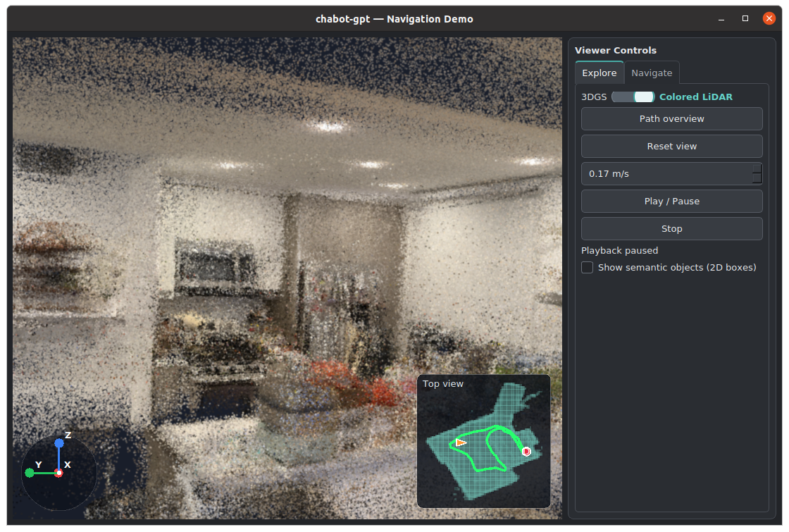
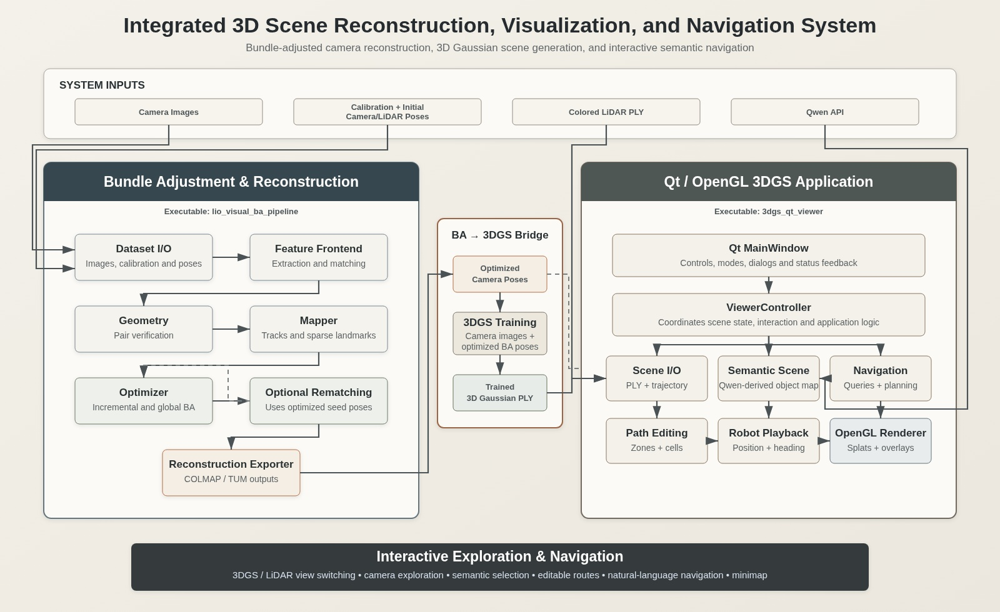

# LiDAR + 3D Gaussian Splatting Digital Twin

A metric-scale 3D environment for scene exploration, semantic navigation, and robot viewpoint simulation. The project combines LiDAR-initialized visual reconstruction, 3D Gaussian Splatting (3DGS), and a C++17 application built with Qt and OpenGL.

Explore a reconstructed room, inspect semantic objects, plan a route to a named target, and replay the route from the robot's viewpoint. Switch between the Gaussian scene and the colored LiDAR map while keeping the camera pose. The digital twin is intended as a foundation for perception testing, operation simulation, and synthetic data generation; the current app demonstrates scene inspection and route playback.

[Demo](#demo) · [Features](#key-features) · [Architecture](#system-architecture) · [Build](#build) · [Performance](#evaluation)

## Demo

### Search for a semantic target

Enter an object name or description to select a navigation destination, such as `go to the white mug`.


### Plan a route through the scene

Define exploration paths in the reconstructed world and inspect them from above. The green control points show the editable route; the minimap provides scene context.



### Follow the robot's viewpoint

Play, pause, resume, or stop an exploration route. Camera position and heading update along the path, with the robot pose shown on the minimap.


### Navigate to an object

Select a confirmed semantic target and follow the planned route toward it. This example approaches a microwave.


### Inspect semantic objects

Object names, IDs, and approximate projected bounding boxes move with the view. Click a box to select an object and inspect its description.



### Compare with colored LiDAR

The colored point cloud exposes the measured scene structure. Switching representations preserves the viewpoint for visual comparison.



### Demo videos

| exploration | navigation |
|:---:|:---:|
| <a href="https://youtu.be/1UWj5hDzwCo"></a> | <a href="https://youtu.be/s6WtcD9oFgs"></a> |
| [exploration](https://youtu.be/1UWj5hDzwCo) | [navigation](https://youtu.be/s6WtcD9oFgs) |

## Key features

### Metric visual reconstruction

- **LiDAR pose priors:** initialize camera poses from a LiDAR/LIO trajectory and calibrated camera–LiDAR extrinsics to retain metric scale.
- **Visual refinement:** use multi-view feature tracks and bundle adjustment to refine camera poses and sparse landmarks.
- **Landmark management:** triangulate verified tracks, reject inconsistent observations, recover weak frames, and extend established tracks.
- **Reconstruction export:** write TUM trajectories, sparse PLY maps, COLMAP camera/image/point files, and evaluation metrics.
- **LiDAR colorization:** preparation tools project camera observations onto LiDAR geometry to produce RGB point clouds.

### LiDAR-supported 3DGS preparation

- **Gaussian initialization:** prepare a registered RGB LiDAR cloud as the initial point set for downstream 3DGS training.
- **Depth supervision:** generate metric depth maps, validity masks, and confidence maps to support geometry constraints during training.
- **Trained scene loading:** open the resulting Gaussian PLY in the viewer. Training runs separately with its own environment and loss configuration.

### Semantic scene understanding

- **Semantic mapping:** associate Qwen-VL-derived labels and descriptions with 3D locations during scene preparation.
- **Object database:** load prepared object classes, descriptions, confidence, review status, and approximate 3D bounds.
- **Semantic overlays:** display object labels and projected bounding boxes in both Gaussian and colored LiDAR views.
- **Object inspection:** select objects directly in the viewport without moving the camera.
- **Object review:** mark objects as **Confirmed**, **Unsure**, or **Incorrect**.
- **Semantic destinations:** find confirmed targets by class, alias, description keywords, and supported spatial relations.

### Qt / OpenGL navigation app

- **Gaussian rendering:** draw anisotropic splats with spherical-harmonic color, opacity, depth sorting, and alpha blending.
- **Scene exploration:** inspect the scene in perspective and edit paths in a top-down orthographic view.
- **View switching:** switch between cached 3DGS and colored LiDAR scenes while preserving the camera viewpoint.
- **Route planning:** edit floor-aligned walkable cells and plan A* routes with obstacle and clearance constraints.
- **Robot playback:** follow routes using distance-based interpolation, look-ahead heading, and smoothed rotation.
- **Navigation minimap:** track the route, robot position, heading, walkable regions, and destination.

## System architecture



*Camera observations and LiDAR pose priors feed reconstruction. Prepared Gaussian scenes, colored LiDAR, and semantic objects feed the exploration and navigation application.*

The two C++ entry points are `lio_visual_ba_pipeline` for reconstruction and `3dgs_qt_viewer` for visualization. See the [architecture reference](ARCHITECTURE.md) for data contracts and component responsibilities.

## Technical details

The system first reconstructs a metric scene from images and LiDAR pose priors. Prepared Gaussian and semantic assets then support rendering and navigation in the app.

```text
Images + LiDAR pose priors
  → feature detection and matching → multi-view tracks
  → triangulation → bundle adjustment → validated reconstruction
  → external 3DGS training and semantic preparation
  → scene rendering → route planning and playback
```

### 1. Feature detection, matching, and tracking

**Goal:** identify the same scene point across several images so its 3D position can be estimated.

#### Detect features across the image

- **Primary features:** SIFT detects distinctive keypoints and describes their local appearance.
- **Coverage:** the image is divided into a grid. Cells with too few SIFT keypoints receive supplemental Shi–Tomasi corners, reducing concentration in highly textured areas.
- **Consistent descriptors:** SIFT descriptors are computed for all keypoints, including supplemental corners, so the same matcher can process them.

The supplemental corners could also support KLT optical-flow tracking in future work; the current pipeline builds tracks from verified descriptor matches.

#### Match appearance, then verify geometry

Temporal neighbors and candidates selected from nearby poses are chosen before matching. Each selected pair passes through two checks:

| Check | Method | Why it matters |
|---|---|---|
| Appearance | `BFMatcher(NORM_L2)` finds the two closest descriptors; Lowe's ratio test rejects ambiguous matches | Similar textures can otherwise produce incorrect correspondences |
| Mutual consistency, when enabled | Match in both directions and retain consistent pairs | Removes one-way associations |
| Geometry with pose priors | Derive the fundamental matrix from camera calibration and relative pose; apply a Sampson-error gate | Tests whether a match agrees with the known camera geometry |
| Geometry without trusted poses | Estimate the fundamental matrix with `USAC_MAGSAC`, then recheck inliers using Sampson error | Estimates geometry while rejecting outliers |
| Pair acceptance | Require enough inliers, a sufficient inlier ratio, and coverage across both images | Prevents a small repeated-texture patch from dominating the pair |

The **fundamental matrix** $F$ relates a point in one image to its expected epipolar line in the other:

$$
\ell_2=Fx_1,\qquad \ell_1=F^Tx_2,
\qquad F=K_2^{-T}[t]_{\times}RK_1^{-1}.
$$

Here, $x_1$ and $x_2$ are homogeneous pixel coordinates, $K_1$ and $K_2$ are camera intrinsics, and $R,t$ describe the relative camera pose. The matrix $[t]_{\times}$ represents the cross product with $t$.

The implemented **Sampson error** approximates geometric mismatch in pixels:

$$
e_{\mathrm{S}}(x_1,x_2)=
\frac{|x_2^TFx_1|}
{\sqrt{\ell_{2,1}^{2}+\ell_{2,2}^{2}+\ell_{1,1}^{2}+\ell_{1,2}^{2}}}.
$$

A small value means the correspondence agrees with the estimated geometry. A match can look similar and still fail this check.

#### Join verified matches into tracks

A **track** collects observations of one candidate scene point across images. Each observation is keyed by `(camera_id, feature_id)`. A disjoint-set union (DSU) joins observations connected by verified matches:

| Relationship between two groups | Action |
|---|---|
| No camera appears in both groups | Merge the groups |
| Both observations already belong to the same group | Ignore the redundant match |
| A camera appears in both groups | Reject the conflicting match |

This rule allows at most one observation per camera in each track. Merging is greedy: the first compatible match wins, and later conflicts are rejected. Short tracks are discarded, and retained tracks receive stable camera/feature ordering. A track is marked supplemental if any observation came from grid supplementation.

**Caching and diagnostics:** accepted matches retain feature IDs, descriptor distances, and geometric errors. Feature and pair caches use fingerprints and checksums; changes to their inputs or configuration invalidate reuse. Accepted, redundant, and conflicting match counts are recorded for inspection.

### 2. Triangulation and landmark filtering

**Goal:** turn each valid track into a 3D landmark and reject unreliable geometry.

#### Estimate a 3D point from multiple views

The direct linear transform (DLT) combines the observations in a track into a linear system. For pixel coordinates $(u_i,v_i)$ and camera projection matrix $P_i$, each view contributes:

$$
\begin{bmatrix}
u_iP_{i,3}-P_{i,1}\\
v_iP_{i,3}-P_{i,2}
\end{bmatrix}X=0.
$$

$P_{i,k}$ denotes row $k$ of the projection matrix. The right singular vector associated with the smallest singular value gives the homogeneous point estimate $X$. Numerical checks reject unstable configurations and points with a homogeneous scale close to zero.

#### Check the estimate against every observation

For camera-to-world rotation $R_i$, camera center $C_i$, and world landmark $X_j$, the point in camera coordinates and its predicted pixel are:

$$
X_{ij}=R_i^T(X_j-C_i),
\qquad
\hat u_{ij}=\begin{bmatrix}
f_xX_{ij,x}/X_{ij,z}+c_x\\
f_yX_{ij,y}/X_{ij,z}+c_y
\end{bmatrix}.
$$

$f_x,f_y$ are focal lengths in pixels, and $c_x,c_y$ define the principal point. Comparing $\hat u_{ij}$ with the observed pixel $u_{ij}$ shows how well the 3D estimate explains the images.

| Quality check | Meaning | Rejection condition |
|---|---|---|
| Numerical stability | The views support a usable DLT solution | Unstable solution or near-zero homogeneous scale |
| Cheirality | The point lies in front of its observing cameras | Non-positive camera depth |
| Parallax | Viewing rays have enough angular separation to constrain depth | Insufficient maximum ray angle |
| Reprojection | The estimated point projects close to the observed features | Pixel errors exceed the configured quality gates |

For unit viewing rays $a$ and $b$, their parallax angle is:

$$
\theta=\cos^{-1}\!\left(\mathrm{clamp}(a^Tb,-1,1)\right).
$$

The largest angle across observing-camera pairs is retained as track parallax. Nearly parallel rays provide weak depth constraints.

The reprojection residual, pixel error, and root mean square error are:

$$
r_{ij}=\hat u_{ij}-u_{ij},\qquad
e_{ij}=\lVert r_{ij}\rVert_2,\qquad
\mathrm{RMSE}=\sqrt{\frac{1}{N}\sum_{ij}e_{ij}^{2}}.
$$

$N$ is the number of evaluated observations. Median and maximum errors are also retained for quality checks and cleanup.

**Observation pruning:** when enabled, the mapper fits a point, removes observations with high residuals, and triangulates again. It records short-track rejections, geometric failures, numerical failures, and pruned observations separately.

### 3. Bundle adjustment

**Goal:** jointly refine camera poses and landmark positions while keeping the reconstruction consistent with the metric LiDAR/LIO trajectory.

#### Balance image evidence with geometric priors

Ceres minimizes three groups of residuals:

$$
\min_{R_i,C_i,X_j}
\sum_{(i,j)}\rho_r\left(\|r_{ij}\|^2\right)
+\sum_i\rho_p\left(\|r_i^{\mathrm{LIO}}\|^2\right)
+\sum_{j\in\mathcal P}\rho_X\left(\|(X_j-X_j^0)/\sigma_j\|^2\right).
$$

| Term | What it constrains | Robust loss |
|---|---|---|
| Reprojection $r_{ij}$ | Predicted landmark pixels should agree with measured image features | Cauchy |
| Pose prior $r_i^{\mathrm{LIO}}$ | Camera poses should remain near their metric LIO initialization | Huber |
| Landmark prior $(X_j-X_j^0)/\sigma_j$ | Eligible landmarks should remain near their initial triangulated positions | Huber |

$\mathcal P$ contains landmarks with an initial position $X_j^0$. The scale $\sigma_j$ controls the strength of each landmark prior. Camera intrinsics remain fixed.

For prior camera center $C_i^0$ and prior rotation quaternion $q_i^0$, the pose residual is:

$$
r_i^{\mathrm{LIO}}=
\begin{bmatrix}
(C_i-C_i^0)/\sigma_t\\
2\,\mathrm{vec}\!\left((q_i^0)^{-1}q_i\right)/\sigma_r
\end{bmatrix}.
$$

The first three components measure translation change. The last three use the vector part of the relative unit quaternion to approximate local rotation change. The scales $\sigma_t$ and $\sigma_r$ control how strongly translation and rotation are constrained.

#### Reduce the influence of outliers

Robust losses reduce the influence of large residuals that might otherwise pull the solution toward incorrect observations:

$$
\rho_{\mathrm{Cauchy}}(s)=c^2\log\!\left(1+\frac{s}{c^2}\right),
\qquad
\rho_{\mathrm{Huber}}(s)=
\begin{cases}
s,&s\leq c^2\\
2c\sqrt{s}-c^2,&s>c^2.
\end{cases}
$$

$s$ is a squared residual norm, and $c$ is the loss scale. The solver maintains valid unit quaternions through a quaternion manifold, keeps designated anchor and constant cameras fixed, and skips observations with invalid depth. A candidate solution is copied back only when Ceres reports that it is usable.

#### Refine locally, then globally

| Mode | Parameters refined | Purpose |
|---|---|---|
| Local BA | A temporal window ending at the newest camera and the landmarks it observes | Incorporate recent observations with bounded computation |
| Global BA | The registered camera prefix and all eligible landmarks, subject to fixed-camera constraints | Refine consistency across the accumulated reconstruction |

During local BA, cameras outside the window remain fixed but still contribute observations of shared landmarks. This connects the local solution to the surrounding map.

**Schedule:** cameras are registered in temporal order. Local BA follows registration, global BA runs at configured checkpoints, and a final global solve runs when needed. Each solve reports camera and landmark counts, residual count, iterations, and initial/final reprojection RMSE.

### 4. Cleanup, recovery, and validation

**Goal:** retain well-supported landmarks, improve weak frames, and verify the exported reconstruction.

1. **Clean observations:** remove observations above the reprojection threshold and delete landmarks with too few remaining observations.
2. **Recover weak cameras:** use robust perspective-n-point (PnP) estimation to recover camera poses from known 3D landmarks and matched image features. Add only PnP inliers, then repeat BA and cleanup.
3. **Extend tracks when enabled:** project existing landmarks into weak frames and check image bounds, descriptor distance, ratio consistency, and epipolar error. A target feature can belong to only one landmark. Retriangulate accepted observations and keep them only if the final reprojection check passes.
4. **Export and validate:** write trajectories, sparse PLY, tracks, observations, metrics, and COLMAP text files. Reopen the outputs to check counts, references, finite geometry, quaternion normalization, reprojection thresholds, and required files.

### 5. LiDAR initialization and depth supervision

**Goal:** use measured LiDAR geometry to support downstream Gaussian reconstruction.

- **Initialization:** a registered RGB LiDAR cloud can provide the initial 3DGS point set. Preparation removes isolated outliers and points far from the camera trajectory.
- **Depth preparation:** project LiDAR geometry into camera views and generate metric depth maps, validity masks, and confidence maps.
- **Training:** a compatible external trainer can use these artifacts to constrain Gaussian geometry. The exact depth loss and its weight depend on the trainer.

### 6. Gaussian rendering

**Goal:** turn a trained Gaussian scene into a view-dependent image.

```text
3D Gaussian → projected ellipse → instanced quad
            → spherical-harmonic color → alpha compositing
```

Each Gaussian stores its position, scale, rotation, opacity, and spherical-harmonic (SH) coefficients. Its scale and rotation define a 3D covariance, which is projected into screen space:

$$
\Sigma_{3D}=RSS^TR^T,\qquad
\Sigma_{2D}=JW\Sigma_{3D}W^TJ^T.
$$

| Symbol | Meaning |
|---|---|
| $R$ | Gaussian rotation |
| $S$ | Diagonal matrix of Gaussian scales |
| $W$ | Rotational part of the world-to-camera transform |
| $J$ | Perspective-projection Jacobian, describing the local change from 3D position to screen position |
| $\Sigma_{2D}$ | Covariance that determines the projected ellipse's size and orientation |

The Gaussian footprint gives pixels near the projected center $\mu$ more weight:

$$
G(x)=\exp\!\left(-\tfrac12(x-\mu)^T\Sigma_{2D}^{-1}(x-\mu)\right).
$$

Here, $x$ is a screen-space pixel position. The renderer draws the ellipse using an instanced quad, evaluates SH color for the viewing direction, and alpha-composites depth-sorted splats.

**Data handling:** Gaussian attributes stay GPU-resident. As the view changes, parallel CPU depth evaluation and radix sorting update the drawing-order index buffer. Experimental GPU-assisted reordering is disabled by default.

### 7. Coordinate systems and scene alignment

**Goal:** keep camera poses, scene geometry, objects, and routes in consistent coordinates.

The LiDAR trajectory defines the metric world frame. Using $T_{AB}$ to map coordinates from frame B into frame A, camera initialization is:

$$
T_{WC}=T_{WL}T_{LC}.
$$

$T_{WL}$ is the LiDAR pose in the world, and $T_{LC}$ maps camera coordinates into the LiDAR frame. Their composition gives the camera pose in the world. Bundle adjustment refines that pose in the same frame.

For navigation, the app applies these steps:

1. **Estimate vertical:** use principal components of the scene geometry to choose a candidate vertical direction, then rotate it toward +Z.
2. **Estimate floor height:** use the aligned geometry to establish a navigation height reference.
3. **Transform consistently:** apply scene alignment and display normalization to semantic objects, routes, the robot, and the minimap.
4. **Save in world coordinates:** convert saved paths back into the original `3dgs_world` frame.

Downstream assets must share a compatible frame and calibration. The current Gaussian and LiDAR maps may still be only approximately registered.

### 8. Route planning and playback

**Goal:** reach a confirmed semantic target and simulate the camera's motion along the route.

- **Choose a destination:** select a reachable stopping cell near the target object.
- **Plan a path:** run A* on an 8-connected walkable grid, allowing horizontal, vertical, and diagonal moves. Obstacle filtering, clearance constraints, and diagonal corner-cutting prevention restrict the search.
- **Follow the route:** interpolate position by traveled distance, estimate heading from a look-ahead point, and smooth rotation.
- **Update the view:** synchronize the simulated pose with the camera and minimap. Pausing allows free inspection; resuming restores the route viewpoint.

## Dependencies

The current app benchmark and build were run on **Ubuntu 20.04.6 LTS**, with a C++17 compiler, CMake, Qt 5, and Mesa OpenGL. The viewer requests OpenGL 3.3 by default.

| Component | Dependencies |
|---|---|
| C++ reconstruction | Eigen3, OpenCV with SIFT, Ceres Solver, nlohmann_json, yaml-cpp, Threads |
| Qt viewer | Reconstruction dependencies, Qt 5.12+ Core/Gui/Widgets/OpenGL/Concurrent, TBB |
| Tests | GoogleTest |
| Optional preparation and inspection | Python; NumPy, SciPy, OpenCV, Matplotlib, or Pillow as required by the selected script |
| External training and semantic extraction | A compatible 3DGS trainer and the Qwen-VL preparation environment; setup is separate from the C++ build |

## Build

From the repository root, install the C++ dependencies on Ubuntu/Debian:

```bash
sudo apt update
sudo apt install build-essential cmake libeigen3-dev libopencv-dev \
  libceres-dev nlohmann-json3-dev libyaml-cpp-dev libgtest-dev \
  qtbase5-dev libqt5opengl5-dev libtbb-dev
```

Configure and build the viewer and reconstruction executable:

```bash
cmake -S . -B build -DCMAKE_BUILD_TYPE=Release \
  -DBUILD_TESTING=ON -DLIO_VISUAL_BA_ENABLE_QT_VIEWER=ON
cmake --build build --target 3dgs_qt_viewer lio_visual_ba_pipeline -j2
```

To build and run the tests:

```bash
cmake --build build -j2
ctest --test-dir build --output-on-failure
```

## Evaluation

### App performance

| Scene | Gaussians | GPU | Average FPS | Mean frame time (ms) | P95 frame time (ms) | Load time (s) | Peak RAM (MiB) |
|---|---:|---|---:|---:|---:|---:|---:|
| 3DGS demo, continuous rotation | 1,814,073 | Intel UHD 620 | 7.58 | 131.88 | 158.62 | 4.356 | 1,952.8 |

**Test configuration:** Intel Core i7-8650U · Intel UHD Graphics 620 · 1100 × 700 requested window · 1,814,073 Gaussians · LiDAR points: not included in this benchmark.

Results are means across three Release-build runs per mode on Ubuntu 20.04.6 / Mesa 21.2.6. Each rendering run discards 10 warm-up frames and measures 120 rotating frames using CPU splat reordering. P95 is the mean of the three per-run P95 values. Loading measures demo setup through the first swapped frame in a fresh process, without clearing the OS file cache. RAM is peak process resident memory; application GPU memory is not reported separately on this shared-memory GPU.

LiDAR rendering, warm view-switch latency, and A* planning latency were not measured in this evaluation.

### KITTI OXTS evaluation — Drive 0035

The Drive 0035 results compare the LIO-prior and optimized camera trajectories
against the KITTI OXTS reference after rigid alignment. OXTS is an independent
reference, not survey-grade camera ground truth. The optimized trajectory
reduces the median and P90 trajectory, orientation, local-motion, and jitter errors. Maximum ATE increases from 0.1677 m to 0.1878 m.

**Trajectory error against the OXTS reference**

ATE denotes absolute trajectory error; P90 and P95 are the 90th and 95th percentiles.

| Metric | LIO prior | Optimized pose (round 2) |
|---|---:|---:|
| ATE median (m) | 0.0492 | 0.0403 |
| ATE P90 (m) | 0.0942 | 0.0789 |
| ATE max (m) | 0.1677 | 0.1878 |
| Orientation error median (deg) | 1.3061 | 0.6043 |
| Orientation error P90 (deg) | 1.5857 | 0.9126 |
| One-frame translation error median (m) | 0.0230 | 0.0206 |
| One-frame translation error P90 (m) | 0.0419 | 0.0404 |
| One-frame rotation error median (deg) | 0.0971 | 0.0147 |
| One-frame rotation error P90 (deg) | 0.1591 | 0.0778 |
| Position jitter median (m) | 0.0166 | 0.0079 |
| Position jitter P90 (m) | 0.0451 | 0.0211 |

**Reconstruction quality across optimization rounds**

| Metric | First round | Second round / final |
|---|---:|---:|
| Landmarks | 19,678 | 19,647 |
| Observations | 152,278 | 168,326 |
| Reprojection median (px) | 0.3938 | 0.2834 |
| Reprojection P90 (px) | 1.0913 | 0.8282 |
| Reprojection P95 (px) | — | 1.0943 |
| Reprojection max (px) | — | 2.0000 |
| Validation | pass | pass |

**Pose correction relative to the LIO prior**

| Quantity | Samples | RMSE | Median | P90 | P95 | Max |
|---|---:|---:|---:|---:|---:|---:|
| Translation displacement | 120 | 0.0328 m | 0.0262 m | 0.0460 m | 0.0568 m | 0.0823 m |
| Rotation displacement | 120 | 0.4875 deg | 0.4476 deg | 0.6620 deg | 0.7428 deg | 0.8363 deg |

The first table measures trajectory error against OXTS, the second measures
reconstruction quality across optimization rounds, and the third measures how
far optimization moved the LIO-prior poses. Displacement is a correction
magnitude, not an absolute accuracy measure.

### Evaluation scope

The KITTI tables describe Drive 0035, a separate dataset from the indoor scene used for the app benchmark. Missing first-round P95 and maximum reprojection errors are shown as em dashes.

Dataset image counts, LiDAR input size, landmark distributions, BA runtime/memory results, and training resource measurements for the featured indoor scene are not yet reported here. The app benchmark measures visualization performance; it does not establish reconstruction accuracy.

## Limitations

- **Geometric degeneracy:** planar walls, limited structure, and low-texture regions can leave pose and geometry estimates weakly constrained.
- **Time synchronization:** camera–LiDAR timestamp errors during motion degrade pose consistency and image-to-map alignment.
- **Extrinsic calibration:** camera–LiDAR rotation or translation errors can produce misalignment, ghosting, and blurred reconstruction.
- **Feature tracking:** motion blur, lighting changes, low texture, and changing image resolution can break visual correspondences. Object-level and semantic tracking are future directions.
- **Photometric consistency:** exposure, white balance, and lighting differences across views can cause inconsistent colors and reconstruction artifacts.
- **Coverage and overlap:** unseen regions and limited viewpoint diversity can leave holes, floaters, or missing geometry.
- **Camera pose accuracy:** small pose errors can blur surfaces, duplicate structures, and reduce detail in the trained Gaussian scene.
- **Rendering hardware:** the measured integrated-GPU result is about 7.6 FPS; smoother rendering at higher resolutions needs more graphics capacity or a smaller workload.
- **Training resources:** 3DGS optimization can require substantial GPU memory. The trainer, training configuration, and measured VRAM usage are not supplied here.
- **Navigation scope:** walkable cells and Gaussian-derived clearance are experimental scene-planning aids. Playback simulates a camera/robot viewpoint; physical robot control, collision certification, and a complete dynamics simulator are outside the current app.
